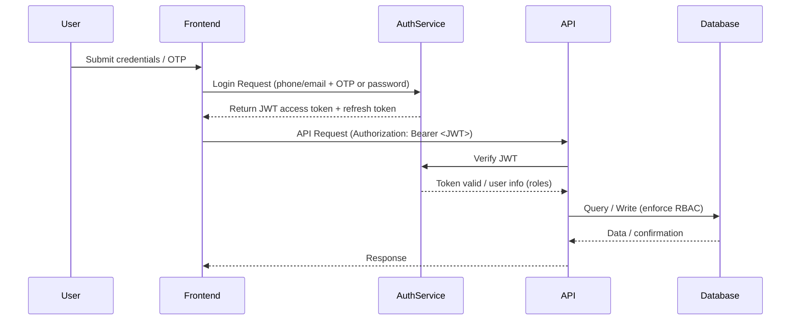

# Government Prototype Architecture Submission — MoICT&NG

Date: 2026-06-01

## 1. System Overview

- What the system does: A lightweight web + mobile prototype to register farmers, record farm transactions and payments, send confirmations, and produce administrative reports. Built as an MVP to support data collection, farmer/cooperative records, payment confirmations, and simple analytics for government review.
- Main users: Farmers (mobile PWA), Field Agents (mobile), Cooperative Admins (web dashboard), Ministry Reviewers / Auditors (web).
- Main components: Mobile PWA and Admin Dashboard (React/Next.js), Backend API (Node.js or Convex), Auth service, Convex DB, file storage, and external services (Convex functions for notifications, Pesapal for payments, Government APIs).
- How users access it: Farmers/agents via PWA (mobile-first), admins via web dashboard; all access over HTTPS with authenticated API calls.

## 2. Main Architecture Components

| Component | Purpose | Technology |
| --------- | ------- | ---------- |
| Frontend | Mobile PWA for farmers/agents; Admin dashboard | React / Next.js |
| Backend/API | Business logic, validation, audit logging | Node.js (Express) or Convex functions |
| Database | Farmer records, transactions, audit logs | Convex (Convex DB) |
| Authentication | User auth and session management | Convex Auth (stateful sessions) |
| File storage | Photos, documents, receipts | Convex storage or S3-compatible bucket |
| Notifications | SMS & email confirmations | Convex functions (operator-configurable adapters) |
| Hosting | Static + serverless functions | Vercel (frontend) + Railway / Fly / Lambda (backend) |
| Payments | Payment callbacks & reconciliation | Pesapal (payment provider) |
| APIs / Integrations | Gov APIs, payment providers, analytics | REST/JSON over HTTPS |
| Analytics / Monitoring | Usage metrics, audit, error logs | Simple event stream -> Postgres / Sentry |

## 3. High-Level Architecture Diagram (Mermaid)

```mermaid
flowchart LR
  U[Farmer / Agent (Mobile PWA)]
  A[Admin (Web Dashboard)]
  FE[Frontend: React / Next.js]
  API[Backend/API: Node.js / Convex]
  AUTH[Auth Service: Convex Auth]
  DB[Database: Convex (Convex DB)]
  FS[File Storage: Convex storage / S3]
  SMS[Notifications: Convex functions]
  PAY[Payment Provider: Pesapal]
  GOV[Gov APIs (NIRA / URA)]
  ANALYTICS[Analytics / Logs]

  U -->|HTTPS Login Request / API Request / Farmer Data| FE
  A -->|HTTPS Login Request / Admin API Request / Reports| FE
  FE -->|HTTPS API Request (Authorization: Bearer JWT)| API
  FE -->|Auth Redirect / Token Exchange| AUTH
  API -->|Verify Token| AUTH
  API -->|SQL Queries / Farmer Records / Transactions| DB
  API -->|Upload / Retrieve Media (signed URLs)| FS
  API -->|Send SMS Notification| SMS
  API -->|Payment Confirmation (Webhook)| PAY
  API -->|Gov Data Exchange / Report Export| GOV
  API -->|Push Reports / Audit Events| ANALYTICS
  DB -->|Audit Logs / Backups| ANALYTICS
```

## 4. Security Notes

- Transport: HTTPS/TLS enforced for all client↔server and server↔external service communication.
- Auth: JWT/OAuth tokens for API access; refresh tokens rotated and stored securely on client.
- Passwords: Salted & hashed per provider (do not store plaintext).
- DB access: Network-restricted credentials; only backend service has write privileges; read roles scoped for reports.
- Encryption: Provider-managed encryption at rest for DB and storage.
- Audit logs: Immutable audit table for admin actions (actor, timestamp, change summary).
- Backups: Daily automated DB backups; retain at least 90 days for audit support.
- Least privilege: Service accounts limited to necessary scopes.
- Operational security: Rate limiting, basic WAF, monitoring and alerting for anomalies.

## 5. Authentication & Access Flow

Steps:
1. User opens PWA or dashboard and submits credentials (email/password or phone + OTP).
2. Frontend sends login request to Auth Service (Convex Auth).
3. Auth Service returns JWT access token and refresh token.
4. Frontend includes JWT in `Authorization` header for API requests.
5. Backend verifies token, enforces RBAC, processes requests and records audit entries for protected actions.

Authentication flow (Mermaid):



## 6. Data Flow Explanation

- Entry: Data enters via PWA or dashboard (HTTPS). External webhooks (payments, SMS delivery) also post to secure endpoints.
- Processing: Backend (Convex functions) validates, applies business rules, writes canonical records to Convex DB. Media assets uploaded to Convex storage or S3 via signed URLs.
- Storage: Structured data in Postgres; binaries in storage; audit records appended for critical changes.
- Protection: Access only via verified tokens; DB creds locked to backend; encrypted transport and rest.
- Reports: Backend runs scheduled or on-demand queries to generate CSV/PDF exports for ministry.

Data flow (Mermaid):

```mermaid
flowchart LR
  UI[User Devices (PWA / Dashboard)]
  API[Backend API]
  AUTH[Auth Service]
  DB[PostgreSQL]
  FS[File Storage]
  PAY[Mobile Money Provider]
  SMS[SMS Provider]
  REPORTS[Reporting / Exports]

  UI -->|Farmer Data / API Request (HTTPS, JWT)| API
  UI -->|Login Request| AUTH
  AUTH -->|Token| UI
  API -->|Verify Token| AUTH
  API -->|Write Farmer Record / Transaction| DB
  API -->|Upload Photo (signed URL)| FS
  PAY -->|Payment Confirmation (Webhook)| API
  API -->|Send SMS Notification| SMS
  DB -->|Event Stream / Audit Rows| REPORTS
  API -->|Generate CSV/PDF (Report Export)| REPORTS
```

## 7. Hosting & Infrastructure

- Frontend: Host on Vercel for static PWA & serverless functions.
- Backend: Railway / Fly / AWS Lambda for serverless functions; keep stateless.
- Database: Managed by Convex (Convex DB) / provider-managed for Convex-hosted deployments.
- Backups: Daily automated backups (Convex-managed) and weekly offsite exports; retain 90 days.
- SSL/HTTPS: Managed by providers (automatic certs).
- Scaling: Start with managed tiers; scale by upgrading plans and adding workers for heavy jobs. Use stateless API design.
- Cost: Vercel + Convex offers low-ops hosting for frontend + backend; move to larger providers as load grows.

## 8. Government Integration Readiness

- API readiness: Versioned REST JSON endpoints; machine-readable exports for ministry.
- NIRA: Provide an adapter for identity verification via NIRA API (requires formal arrangement).
- URA: Provide transaction summary export (CSV/PDF) for tax reporting.
- Payments: Pesapal webhook endpoints for confirmation; idempotency keys and reconciliation.
- Interoperability: Use JSON, ISO8601 timestamps, clear field definitions.
- Audit: Immutable logs for all government data exchanges and exports.

## 9. Technology Summary

| Layer | Technology | Reason |
| ----- | ---------- | ------ |
| Presentation | React / Next.js (PWA) | Fast to build, mobile-first, easy to host on Vercel |
| API | Node.js / Convex functions | Serverless-friendly, simple auth integration |
| Data | Convex (Convex DB) | ACID-like transactions via Convex, easy exports for govt reporting |
| Auth | Convex Auth | Stateful sessions with immediate revocation |
| Storage | Convex storage or S3 | Signed URLs, scalable |
| Messaging | Convex functions (adapter) | Operator-configurable SMS/email adapters (e.g., Twilio/SendGrid)
| Hosting | Vercel + Railway | Low-cost, easy to scale |

---

### Files added in this workspace
- ARCHITECTURE_SUBMISSION.md (this file)
- architecture_diagram.drawio (draw.io format XML) — open in https://app.diagrams.net and export PNG

### Export instructions
- To create a PDF from this Markdown (quick): open the file in VS Code and use "Print to PDF" or run:

```bash
# using pandoc (if installed):
pandoc ARCHITECTURE_SUBMISSION.md -o ARCHITECTURE_SUBMISSION.pdf --standalone
```

- To get a PNG for diagrams: open `architecture_diagram.drawio` in https://app.diagrams.net, then `File → Export as → PNG`.

# Government Systems Prototype Showcase — Architecture Submission

This document is a concise, government-ready architecture package for a simple farmer-facing data & transaction prototype. It is optimized for a solo founder building an MVP with minimal ops while meeting security and interoperability expectations.

## 1. System Overview

- **What the system does:** Collects farmer records, records transactions and payments, supports field-agent registration and document uploads, sends notifications, and provides an admin dashboard with exportable reports for ministry review.
- **Main users:** Farmers (mobile), Field Agents (mobile), Cooperative Admins (web), Ministry Auditors (web).
- **Main components:** Mobile PWA + Admin Dashboard, Backend API/Functions, Auth Service, Relational Database, File Storage, External SMS/Payment providers.
- **How users access it:** Mobile users use a PWA (or lightweight Android wrapper). Admins use a web dashboard. All access over HTTPS with authenticated API calls.

## 2. Main Architecture Components

| Component | Purpose | Technology |
| --------- | ------- | ---------- |
| Frontend | Mobile PWA for farmers/agents; Admin dashboard | React / Next.js |
| Backend/API | Business logic, validation, auth checks, audit logging | Node.js or Convex functions |
| Database | Persistent farmer records, transactions, audit logs | Convex (Convex DB) |
| Authentication | User auth and session management | Convex Auth (stateful sessions) |
| File storage | Photos, documents, receipts | Convex storage or S3-compatible |
| Notifications | SMS & email for confirmations and alerts | Convex functions (operator-configurable adapters) |
| Hosting | Web hosting & serverless functions | Vercel (frontend) + Railway / small cloud for API |
| Payments | Payment confirmations / receipts | Pesapal (payment provider) |
| APIs / Integrations | Gov APIs, payment providers, analytics | REST/JSON over HTTPS |
| Analytics / Monitoring | Usage metrics, audit, error logs | DB events + Sentry / simple analytics |

## 3. High-Level Architecture Diagram

See `diagrams/architecture.mmd` for the Mermaid diagram (also included below for quick copy).

## 4. Security Notes

- HTTPS/TLS enforced for all client ↔ server and server ↔ external API traffic.
- Authenticated endpoints require JWTs; refresh tokens stored securely on client.
- Passwords hashed (managed by Convex Auth or equivalent); never store plaintext.
- DB access limited to backend service account; read-only roles for reporting.
- Audit logs: every admin or sensitive action appended to an audit table with actor, timestamp, and change summary.
- Backups: daily snapshots + weekly offsite exports; retain 90 days minimal.
- Least-privilege service accounts; environment secrets stored in provider secret manager.

## 5. Authentication & Access Flow

1. User submits credentials (OTP or email/password) via PWA or Dashboard.
2. Frontend calls Auth Service; upon success gets JWT + refresh token.
3. Frontend sends JWT in `Authorization` header to API for protected requests.
4. Backend verifies JWT, enforces RBAC, performs action, and logs to audit.

See `diagrams/auth-flow.mmd` for the flow diagram.

## 6. Data Flow Explanation

- **Ingress:** Data enters via PWA/dashboard (HTTPS) or external webhooks (payment confirmations).
- **Processing:** Backend validates, applies business rules, writes canonical records to Postgres. Media uploaded to storage with signed URLs.
- **Storage:** Structured data in Postgres; binaries in storage. Audit table captures critical changes.
- **Protection:** API-only DB writes; network rules on DB; JWT required for API calls.
- **Reporting:** Scheduled queries or live-read endpoints produce CSV/PDF exports for ministry reporting.

See `diagrams/data-flow.mmd` for the diagram.

## 7. Hosting & Infrastructure

- **Frontend:** Vercel for static + serverless ease.
- **Backend:** Railway, Fly, or serverless functions (small Node.js service); keep stateless (Convex used for backend logic where appropriate).
- **Database:** Convex-managed database (Convex DB).
- **Storage:** Convex storage or S3-compatible bucket.
- **Backups:** Daily DB snapshots (Convex-managed); weekly offsite export for audits.
- **SSL/HTTPS:** Managed by hosting provider (automatic certs).
- **Scalability:** Start with managed, serverless-friendly services; design stateless API so horizontal scaling is trivial.

## 8. Government Integration Readiness

- **API readiness:** Versioned REST JSON endpoints; API keys or OAuth client credentials for gov systems.
- **NIRA:** Adapter-ready identity verification endpoint; plan formal approval and secure client credentials for live NIRA access.
- **URA:** Provide transactional exports (CSV/PDF) with invoice metadata.
- **Mobile money:** Webhook endpoints for confirmations; idempotency keys and reconciliation by `payment_reference`.
- **Interoperability:** Use UTC ISO8601 timestamps and clear field contracts.
- **Audit:** Immutable audit trails for all ministry exchanges; exportable on request.

## 9. Technology Summary

| Layer | Technology | Reason |
| ----- | ---------- | ------ |
| Presentation | React / Next.js (PWA) | Fast to build, mobile-friendly, easy hosting on Vercel |
| API | Node.js or Convex functions | Serverless-friendly, simple auth integration |
| Data | Convex (Convex DB) | ACID-like transactions via Convex, easy exports for gov reports |
| Auth | Convex Auth | Stateful sessions, immediate revocation |
| Storage | Convex storage or S3 | Signed-URL uploads, scalable |
| Messaging | Convex functions (adapter) | Operator-configurable SMS/email adapters (e.g., Twilio/SendGrid) |
| Hosting | Vercel + Convex | Low-ops, integrated frontend + backend hosting |

---

Files included in this package:
- `ARCHITECTURE_SUBMISSION.md` (this file)
- `diagrams/architecture.mmd`
- `diagrams/auth-flow.mmd`
- `diagrams/data-flow.mmd`
- `README_EXPORT.md` (export instructions for PDF and PNG)

Prepared for PDF export and draw.io import/export.
